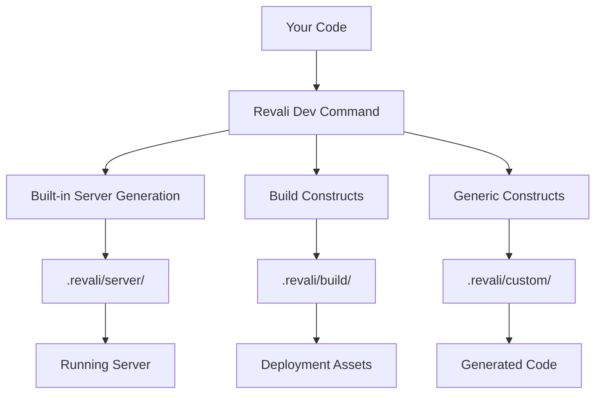

Constructs are the heart of Revali's extensibility. They are standalone Dart packages that provide code generation capabilities, allowing you to extend Revali's functionality or create entirely new features.

## What is a Construct?

A construct is a Dart package that provides code generation capabilities to Revali. Constructs are imported into your project, automatically detected by Revali, and used to generate code based on your annotations and route definitions.

When you run the `dev` command, constructs analyze your code and generate new files, assets, or code within their own dedicated directories:

```tree
.revali/
├── server/          # Built into Revali — generated for every project
├── client/          # Generated by client constructs
├── docker/          # Generated by docker constructs
└── <custom>/        # Generated by custom constructs
```



<Callout type="tip">

Learn more about the [dev command](/revali/cli/dev) and how constructs integrate with Revali's development workflow.

</Callout>

## Server Generation

Revali generates your server's code — request routing, middleware, and response handling — built in, with no separate construct to install or configure. See the [Revali Server docs](/constructs/revali_server) for the classes and annotations it generates from.

## Types of Constructs

Beyond server generation, Revali supports these types of constructs:

### Build Constructs

Build constructs generate code, assets, or files needed for deployment and production builds. They run during the build process and prepare your application for distribution.

**Key characteristics:**

- Generate code in the `.revali/build` directory
- Run during the build command (`build` command)
- Prepare assets for deployment
- Can generate client-side code, documentation, or deployment configs

<Callout type="info">

**Multiple Build Constructs**: You can use multiple build constructs in the same project, allowing for complex build pipelines.

</Callout>

**Popular Build Constructs:**

- **[revali_client](/constructs/revali_client)**: Generate client-side code for API consumption
- **[revali_docker](/constructs/revali_docker)**: Generate Docker configuration and deployment files
- **[revali_swagger](/constructs/revali_swagger)**: Generate an OpenAPI 3.0.3 spec from your routes

## Opt-In Constructs

Some constructs require explicit activation in your `revali.yaml` configuration file. This allows for:

- **Conditional activation**: Enable constructs only when needed
- **Configuration control**: Fine-tune construct behavior
- **Performance optimization**: Avoid unnecessary code generation

### Enabling Opt-In Constructs

Add the construct to your `revali.yaml` file:

<CodeFile name="revali.yaml">

```yaml
constructs:
  - name: revali_docker
    enable: true
    config:
      # construct-specific configuration
```

</CodeFile>

<Callout type="tip">

**Default Behavior**: If a construct doesn't specify opt-in requirements, it's enabled automatically when added to your dependencies within your `pubspec.yaml` file.

</Callout>

## Creating Custom Constructs

Want to extend Revali with your own functionality? You can create custom constructs for:

- **Custom protocols**: Support for WebSocket, gRPC, or other protocols
- **Framework integrations**: Connect with specific databases or services
- **Code generation**: Generate custom boilerplate or utilities
- **Deployment tools**: Create deployment scripts or configurations

<Callout type="tip">

Learn how to [create your own constructs](/create-constructs) and extend Revali's capabilities.

</Callout>

## Finding Constructs

Discover available constructs on [pub.dev](https://pub.dev/packages?q=dependency%3Arevali_construct) or browse the official constructs:

- **[revali_client](/constructs/revali_client)**: Client-side code generation
- **[revali_docker](/constructs/revali_docker)**: Docker deployment support
- **[revali_swagger](/constructs/revali_swagger)**: OpenAPI 3.0.3 spec generation
