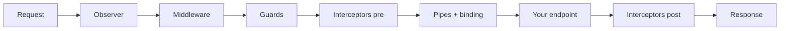

Revali Server is the code generator that turns your controllers into an HTTP
server. It is built into `revali`, so there is nothing extra to install. To
set up a project, start with [Getting Started](/revali/getting-started/installation).
This section is the reference for everything you write in `routes/` and
`lib/components/`.

## Request lifecycle

Each request passes through these stages in order. Every stage is optional
and can be scoped to the whole app, a controller or a single endpoint.

An exception thrown at any stage goes to the nearest matching
[exception catcher](/constructs/revali_server/lifecycle-components). See
[Lifecycle Components](/constructs/revali_server/lifecycle-components) for the
execution order in full and how to write each component.

## Where to find things

| You want to… | Read |
| --- | --- |
| Declare routes and HTTP methods | [Controllers](/constructs/revali_server/core/controllers), [HTTP Methods](/constructs/revali_server/core/methods) |
| Read params, query, body, headers, cookies | [Binding](/constructs/revali_server/core/binding) |
| Validate or convert bound values | [Pipes](/constructs/revali_server/core/pipes) |
| Work with the raw request | [Request](/constructs/revali_server/request) |
| Set status, headers, cookies, or stream a body | [Response](/constructs/revali_server/response) |
| Serve SSE or WebSockets | [Server-Sent Events](/constructs/revali_server/response/server-sent-events), [WebSockets](/constructs/revali_server/response/websockets) |
| Share data between components and endpoints | [Context](/constructs/revali_server/context) |
| Add auth, logging, error mapping or rate limits | [Lifecycle Components](/constructs/revali_server/lifecycle-components) |
| Configure CORS and required headers | [Access Control](/constructs/revali_server/access-control/allow-origins) |
| Change host, port, prefix, DI or shutdown | [App Configuration](/revali/app-configuration) |
