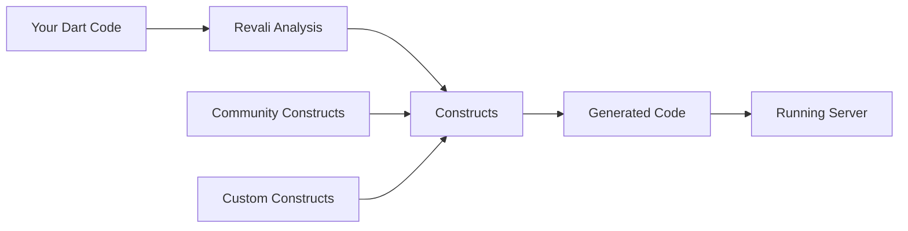

## What is Revali?

Revali is a modern, fast, and powerful Dart API framework that makes building robust web services effortless. It leverages annotations within your classes, methods, and method parameters to automatically generate API code, allowing developers to focus on writing clean, maintainable business logic while Revali handles the boilerplate.

## Key Features

- **Type-Safe**: Built on Dart's strong typing system for compile-time safety
- **Annotation-Driven**: Define APIs using simple, intuitive annotations
- **Highly Extendable**: Create custom constructs or use community packages
- **Rapid Development**: Minimal setup and configuration required
- **Hot Reload**: Instant development feedback with hot reload support
- **Production-Ready**: [Health probes](/revali/app-configuration/health-probes), [graceful shutdown](/revali/app-configuration/graceful-shutdown), [request tracing](/revali/app-configuration/tracing) and [worker isolates](/revali/app-configuration/workers) come with the framework

## More Than One Service

A system split across several services is several servers to run, wire together and deploy. Revali treats them as one system:

- **[Messaging](/revali/messaging)** — consume queue messages with `@Consumes`, backed by a broker you deploy
- **[`revali up`](/revali/cli/up)** — run every service in the repository at once, on one screen
- **[`revali compose`](/revali/cli/compose)** — a `docker-compose.yaml` for the same set
- **[Error Responses](/revali/app-configuration/error-responses)** — structured errors that survive a service-to-service call

## How does it work?

Revali analyzes your Dart classes, methods, and annotations to generate your server code — built in, no extra package needed. Beyond the server, Revali's capabilities can be extended with "constructs": standalone Dart packages that are imported into your project, automatically detected by Revali, and used to generate additional code (client SDKs, OpenAPI docs, Docker deployment, or your own).

<Callout type="tip">

Learn more about [constructs](/constructs) and how they power Revali's code generation.

</Callout>

## Quick Start

Ready to build your first API? Get started in minutes:

1. **[Install Revali](/revali/getting-started/installation)** - Add Revali to your project
2. **[Create Your First Endpoint](/revali/getting-started/create-your-first-endpoint)** - Build a simple API endpoint
3. **[Run the Server](/revali/getting-started/run-the-server)** - See your API in action

<Callout type="info">

For a complete server implementation, check out the [Revali Server](/constructs/revali_server) guide.

</Callout>
