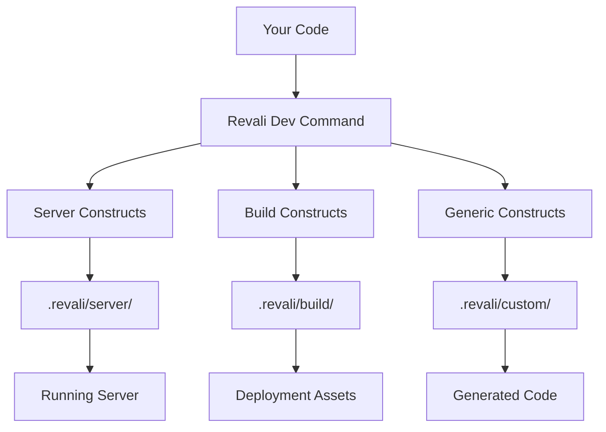

# Constructs

Constructs are the heart of Revali's extensibility. They are standalone Dart packages that provide code generation capabilities, allowing you to extend Revali's functionality or create entirely new features.

## What is a Construct?

A construct is a Dart package that provides code generation capabilities to Revali. Constructs are imported into your project, automatically detected by Revali, and used to generate code based on your annotations and route definitions.

When you run the `dev` command, constructs analyze your code and generate new files, assets, or code within their own dedicated directories:

```tree
.revali/
├── server/          # Generated by server constructs
├── client/          # Generated by client constructs
├── docker/          # Generated by docker constructs
└── <custom>/        # Generated by custom constructs
```



:::tip
Learn more about the [dev command](/revali/cli/dev) and how constructs integrate with Revali's development workflow.
:::

## Types of Constructs

Revali supports two main types of constructs, each serving a specific purpose:

### Server Constructs

Server constructs generate the core server-side code for your Revali application. They handle HTTP request routing, middleware, and response generation.

**Key characteristics:**

- Generate code in the `.revali/server` directory
- Handle incoming HTTP requests and return responses
- Provide the runtime foundation for your API
- Run during development (`dev` command)

:::important
**One Server Construct Limit**: You can only use **one** server construct per project. This ensures a single, consistent server implementation.
:::

**Popular Server Constructs:**

- **[revali_server](/constructs/revali_server/overview)**: The default server construct with full HTTP support

### Build Constructs

Build constructs generate code, assets, or files needed for deployment and production builds. They run during the build process and prepare your application for distribution.

**Key characteristics:**

- Generate code in the `.revali/build` directory
- Run during the build command (`build` command)
- Prepare assets for deployment
- Can generate client-side code, documentation, or deployment configs

:::info
**Multiple Build Constructs**: You can use multiple build constructs in the same project, allowing for complex build pipelines.
:::

**Popular Build Constructs:**

- **[revali_client](/constructs/revali_client/overview)**: Generate client-side code for API consumption
- **[revali_docker](/constructs/revali_docker/overview)**: Generate Docker configuration and deployment files

## Opt-In Constructs

Some constructs require explicit activation in your `revali.yaml` configuration file. This allows for:

- **Conditional activation**: Enable constructs only when needed
- **Configuration control**: Fine-tune construct behavior
- **Performance optimization**: Avoid unnecessary code generation

### Enabling Opt-In Constructs

Add the construct to your `revali.yaml` file:

```yaml title="revali.yaml"
constructs:
  - name: revali_server
    enable: true
    config:
      # construct-specific configuration
```

:::tip
**Default Behavior**: If a construct doesn't specify opt-in requirements, it's enabled automatically when added to your dependencies within your `pubspec.yaml` file.
:::

## Creating Custom Constructs

Want to extend Revali with your own functionality? You can create custom constructs for:

- **Custom protocols**: Support for WebSocket, gRPC, or other protocols
- **Framework integrations**: Connect with specific databases or services
- **Code generation**: Generate custom boilerplate or utilities
- **Deployment tools**: Create deployment scripts or configurations

:::tip
Learn how to [create your own constructs](/create-constructs) and extend Revali's capabilities.
:::

## Finding Constructs

Discover available constructs on [pub.dev](https://pub.dev/packages?q=dependency%3Arevali_construct) or browse the official constructs:

- **[revali_server](/constructs/revali_server/overview)**: Complete server implementation
- **[revali_client](/constructs/revali_client/overview)**: Client-side code generation
- **[revali_docker](/constructs/revali_docker/overview)**: Docker deployment support
