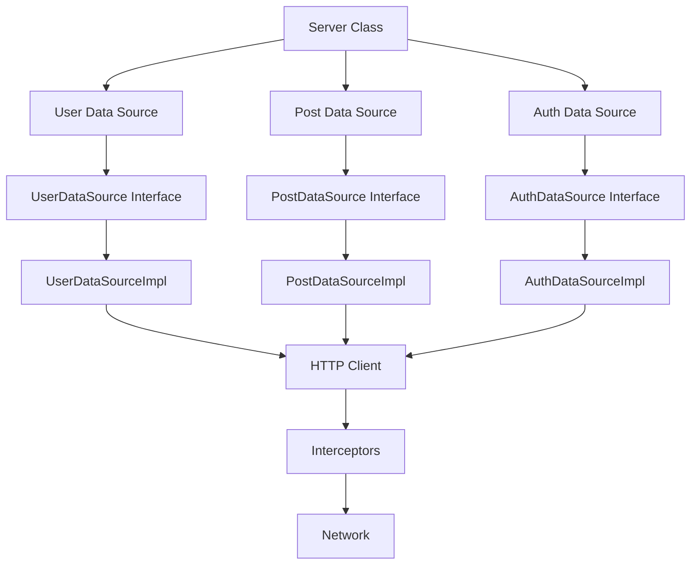

# Revali Client

Revali Client is a [Build Construct](/constructs#build-constructs) that generates type-safe, idiomatic Dart client code for consuming Revali Server APIs. It automatically creates clean, testable client libraries that mirror your server's endpoints, enabling seamless communication between your frontend and backend.

## What is Revali Client?

Revali Client analyzes your Revali Server routes and automatically generates corresponding client-side code. This ensures your client code stays in sync with your server implementation, provides compile-time type safety, and eliminates the need to manually write HTTP client code.

**Key capabilities:**

- **Type-Safe API Calls**: Compile-time verification of all API requests and responses
- **Automatic Code Generation**: Client code generated directly from server definitions
- **Clean Architecture**: Interface-based design following SOLID principles
- **Flexible Configuration**: HTTP interceptors, storage, and custom integrations
- **Framework Agnostic**: Works with Flutter, web, or any Dart project

## Key Features

### 🎯 **Type Safety**

- Full compile-time type checking for requests and responses
- IntelliSense support for all API endpoints
- Automatic serialization and deserialization
- No runtime type errors from API mismatches

### 🏗️ **Clean Architecture**

- **Interfaces**: Abstract definitions for each API resource
- **Implementations**: Concrete HTTP client implementations
- **Testability**: Easy mocking and dependency injection
- **Maintainability**: Clear separation of concerns

### 🔌 **Extensible**

- **HTTP Interceptors**: Modify requests/responses globally
- **Storage**: Built-in session and persistent storage
- **Custom Headers**: Add authentication, logging, and more
- **Error Handling**: Centralized exception management

### 📦 **Developer Experience**

- Automatic synchronization with server changes
- Clean, readable generated code
- Support for all HTTP methods
- Query parameters, headers, and body handling
- File upload support

## Getting Started

Ready to generate your first client? Follow these steps:

1. **[Installation](/constructs/revali_client/getting-started/installation)** - Set up Revali Client
2. **[Configure](/constructs/revali_client/getting-started/configure)** - Configure client generation
3. **[Use the Client](/constructs/revali_client/generated-code)** - Learn about the generated code structure

## Architecture Overview

Revali Client generates a structured, modular client library:



### Components

- **Server Class**: Main entry point providing access to all data sources
- **Data Source Interfaces**: Abstract definitions of available API methods
- **Data Source Implementations**: Concrete HTTP client implementations
- **HTTP Client**: Underlying HTTP transport layer
- **Interceptors**: Request/response transformation pipeline
- **Storage**: Session and persistent data management

## Example: Simple Client Usage

Here's a quick example of using a generated Revali Client:

```dart
import 'package:revali_client/client.dart';
import 'package:revali_client/interfaces.dart';

void main() async {
  // Create the client instance
  final server = Server();

  // Type-safe API calls
  final users = await server.user.getUsers();

  // Create a new user
  final newUser = await server.user.createUser(
    User(name: 'Alice', email: 'alice@example.com'),
  );

  // Get a specific user by ID
  final user = await server.user.getUser(id: newUser.id);

  print('User: ${user.name}');
}
```

This automatically:

- Constructs the correct HTTP requests
- Serializes request bodies
- Deserializes responses
- Handles network errors
- Provides type safety at every step

## Generated Code Structure

The client generates clean, organized code:

```text
.revali/
└── revali_client/
    ├── lib/
    │   ├── client.dart           # All implementations
    │   ├── interfaces.dart       # All interfaces
    │   └── src/
    │       ├── server.dart       # Main Server class
    │       ├── impls/            # Implementation classes
    │       │   └── user_data_source_impl.dart
    │       └── interfaces/       # Interface definitions
    │           └── user_data_source.dart
    └── pubspec.yaml
```

### Interface-Based Design

For each server controller, Revali Client generates:

- **Interface**: Defines the contract (`UserDataSource`)
- **Implementation**: Implements the HTTP calls (`UserDataSourceImpl`)

This enables:

- Easy testing with mocks
- Dependency injection
- Swappable implementations
- Clean architecture adherence

## Advanced Features

### HTTP Interceptors

Add global request/response handling:

```dart
class AuthInterceptor implements HttpInterceptor {
  @override
  Future<HttpRequest> onRequest(HttpRequest request) async {
    return request.copyWith(
      headers: {...request.headers, 'Authorization': 'Bearer $token'},
    );
  }
}
```

[Learn more about HTTP Interceptors](/constructs/revali_client/getting-started/http-interceptors)

### Storage

Built-in storage for session data and persistence:

```dart
// Access session storage
server.session.set('userId', user.id);
final userId = server.session.get('userId');

// Access persistent storage
server.storage.set('theme', 'dark');
final theme = server.storage.get('theme');
```

[Learn more about Storage](/constructs/revali_client/getting-started/storage)

### Dependency Injection

Integrate with popular DI frameworks:

```dart
// get_it integration
GetIt.I.registerLazySingleton<UserDataSource>(
  () => server.user,
);
```

[Learn more about get_it Integration](/constructs/revali_client/integrations/get_it)

## Why Choose Revali Client?

- **Productivity**: Eliminate boilerplate HTTP client code
- **Type Safety**: Catch errors at compile-time, not runtime
- **Maintainability**: Automatic updates when server changes
- **Testability**: Built for clean architecture and testing
- **Flexibility**: Customize every aspect of HTTP communication

:::note
**Server Integration**: Revali Client is designed to work seamlessly with [Revali Server](/constructs/revali_server/overview), but can be used with any REST API that follows similar conventions.
:::

## Next Steps

- **[Installation Guide](/constructs/revali_client/getting-started/installation)** - Set up Revali Client
- **[Configuration](/constructs/revali_client/getting-started/configure)** - Configure client generation
- **[Generated Code](/constructs/revali_client/generated-code)** - Understand the generated structure
- **[HTTP Interceptors](/constructs/revali_client/getting-started/http-interceptors)** - Add request/response handling
- **[Storage](/constructs/revali_client/getting-started/storage)** - Manage session and persistent data
