# Revali Server

Revali Server is the default server construct that generates comprehensive server-side code for Revali applications. It provides a powerful, type-safe way to build HTTP APIs using annotations, inspired by modern frameworks like NestJS.

## What is Revali Server?

Revali Server is a [Server Construct](/constructs#server-constructs) that generates the complete server implementation for your Revali application. It handles:

- **HTTP Request Routing**: Automatic route generation from your controllers
- **Middleware Support**: Request/response processing pipeline
- **Type Safety**: Compile-time type checking for all endpoints
- **Hot Reload**: Instant development feedback
- **Error Handling**: Comprehensive error management
- **Request/Response Processing**: Automatic serialization and validation

## Key Features

### 🚀 **Rapid Development**

- Define APIs using simple annotations
- Automatic route generation
- Hot reload for instant feedback
- Minimal boilerplate required

### 🛡️ **Type Safety**

- Compile-time type checking
- Automatic request/response validation
- IntelliSense support for all endpoints
- Runtime type safety

### 🔧 **Extensible Architecture**

- Middleware support for cross-cutting concerns
- Guards for authentication and authorization
- Interceptors for request/response transformation
- Pipes for data validation and transformation

### 📦 **Rich Feature Set**

- Support for all HTTP methods (GET, POST, PUT, DELETE, etc.)
- Request body parsing and validation
- Query parameter handling
- Header management
- Cookie support
- File upload capabilities
- WebSocket support
- Server-Sent Events (SSE)

## Getting Started

Ready to build your first server? Follow these steps:

1. **[Installation](/constructs/revali_server/getting-started/installation)** - Set up Revali Server
2. **[Create Your First Endpoint](/constructs/revali_server/getting-started/create-your-first-endpoint)** - Build a simple API endpoint
3. **[Run the Server](/constructs/revali_server/getting-started/run-the-server)** - Start your development server

## Architecture Overview

Revali Server follows a layered architecture:

```mermaid
graph TD;
    A[HTTP Request] --> B[Pre-processing];
    B --> C[Controller];
    C --> D[Post-processing];
    D --> E[HTTP Response];

    %% Pre-processing details
    subgraph PreFlow [ ]
        B1[Observer ⟮pre⟯] --> B2[Middleware] --> B3[Guards] --> B4[Interceptors ⟮pre⟯] --> B5[Pipes];
    end
    B -.-> B1;

    %% Post-processing details
    subgraph PostFlow [ ]
        D1[Interceptors ⟮post⟯] --> D2[Observer ⟮post⟯];
    end
    D -.-> D1;
```



### Components

- **Controllers**: Define your API endpoints
- **Middleware**: Process requests before they reach controllers
- **Guards**: Handle authentication and authorization
- **Interceptors**: Transform requests and responses
- **Pipes**: Validate and transform data
- **Exception Catchers**: Handle errors gracefully

## Example: Simple API

Here's a quick example of what you can build with Revali Server:

```dart title="routes/users_controller.dart"
import 'package:revali_router/revali_router.dart';

@Controller('users')
class UsersController {
  @Get()
  Future<List<User>> getUsers() async {
    return await userService.getAllUsers();
  }

  @Post()
  Future<User> createUser(@Body() User user) async {
    return await userService.createUser(user);
  }

  @Get(':id')
  Future<User> getUser(@Param('id') String id) async {
    return await userService.getUserById(id);
  }
}
```

This creates a complete REST API with:

- `GET /api/users` - Get all users
- `POST /api/users` - Create a new user
- `GET /api/users/:id` - Get a specific user

## Why Choose Revali Server?

- **Productivity**: Focus on business logic, not boilerplate
- **Scalability**: Built for applications of any size
- **Maintainability**: Clean, organized code structure
- **Performance**: Optimized for high-throughput applications
- **Developer Experience**: Excellent tooling and debugging support

:::important
**Single Server Construct**: You can only use one server construct per project. Revali Server is the recommended choice for most applications.
:::

## Next Steps

- **[Getting Started Guide](/constructs/revali_server/getting-started/installation)** - Complete setup tutorial
- **[Core Concepts](/constructs/revali_server/core/controllers)** - Learn about controllers and routing
- **[Advanced Features](/constructs/revali_server/lifecycle-components/overview)** - Explore middleware, guards, and more
- **[Request/Response Handling](/constructs/revali_server/request/overview)** - Master request processing
