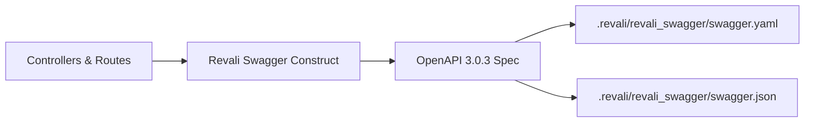

# Revali Swagger

Revali Swagger is a construct that automatically generates an [OpenAPI 3.0.3](https://spec.openapis.org/oas/v3.0.3) specification from your Revali route definitions — no manual spec writing required.

## What is Revali Swagger?

Revali Swagger reads your controllers, routes, parameters, and return types at code-generation time and produces `swagger.yaml` and `swagger.json` files that describe your entire API. It works alongside your existing Revali Router annotations (`@Body`, `@Query`, `@Param`, `@Header`, `@Cookie`) so there's nothing new to add for a working spec.

Optional annotations from `revali_swagger_annotations` let you enrich the spec with summaries, descriptions, additional response codes, and custom tags — but they are never required.

## Key Features

### 📄 **Zero-Config Generation**

Drop the package in, run `revali dev`, and fully valid OpenAPI specs appear in `.revali/revali_swagger/swagger.yaml` and `.revali/revali_swagger/swagger.json`. No annotations or configuration needed to get started.

### 🔍 **Automatic Type Introspection**

Dart primitives, collections, records, enums, sealed classes, and custom classes are all converted to JSON Schema automatically. Fields are walked up the superclass chain so inherited properties are included.

### 🏷️ **Optional Annotation Overrides**

Use `@ApiSummary`, `@ApiDescription`, `@ApiTag`, `@ApiResponse`, and `@ApiHidden` to add human-readable context to the generated spec without changing your API logic.

### 📄 **YAML and JSON Output**

Both `swagger.yaml` and `swagger.json` are generated on every run so you can use whichever format your tooling expects.

### ⚠️ **Helpful Warnings**

When a type cannot be resolved automatically (e.g. `Duration`, external types), a warning is written to stderr with a suggestion to use `@ApiType` to specify the schema explicitly.

## How It Works

When you run `revali dev`, the construct:

1. Reads every controller and route from your project
2. Maps each parameter to its OpenAPI location (`path`, `query`, `header`, `cookie`, or `requestBody`)
3. Converts Dart types to JSON Schema, registering complex types in `components/schemas`
4. Writes the assembled spec to `.revali/revali_swagger/swagger.yaml` and `.revali/revali_swagger/swagger.json`



## Quick Example

Given this controller:

```dart title="routes/users/users_controller.dart"
import 'package:revali_router_annotations/revali_router_annotations.dart';

@Controller('users')
class UsersController {
  @Get(':id')
  Future<User> getById(@Param() String id) async { ... }

  @Post('')
  @StatusCode(201)
  Future<User> create(@Body() CreateUserBody body) async { ... }
}
```

Revali Swagger generates:

```yaml title=".revali/revali_swagger/swagger.yaml"
openapi: 3.0.3
info:
  title: API
  version: 1.0.0
paths:
  /users/{id}:
    get:
      operationId: users_getById
      tags:
        - users
      parameters:
        - name: id
          in: path
          required: true
          schema:
            type: string
      responses:
        '200':
          description: Success
          content:
            application/json:
              schema:
                $ref: '#/components/schemas/User'
  /users:
    post:
      operationId: users_create
      tags:
        - users
      requestBody:
        required: true
        content:
          application/json:
            schema:
              $ref: '#/components/schemas/CreateUserBody'
      responses:
        '201':
          description: Success
          ...
components:
  schemas:
    User:
      type: object
      properties:
        id:
          type: string
        name:
          type: string
      required:
        - id
        - name
    CreateUserBody:
      ...
```

## Getting Started

Ready to add OpenAPI docs to your Revali API?

1. **[Installation](/constructs/revali_swagger/getting-started/installation)** — Add the packages and register the construct
2. **[Configuration](/constructs/revali_swagger/getting-started/configuration)** — Set the API title and version
3. **[Annotations](/constructs/revali_swagger/annotations)** — Enrich your spec with summaries and descriptions
4. **[Type Inference](/constructs/revali_swagger/type-inference)** — Learn how Dart types map to JSON Schema
