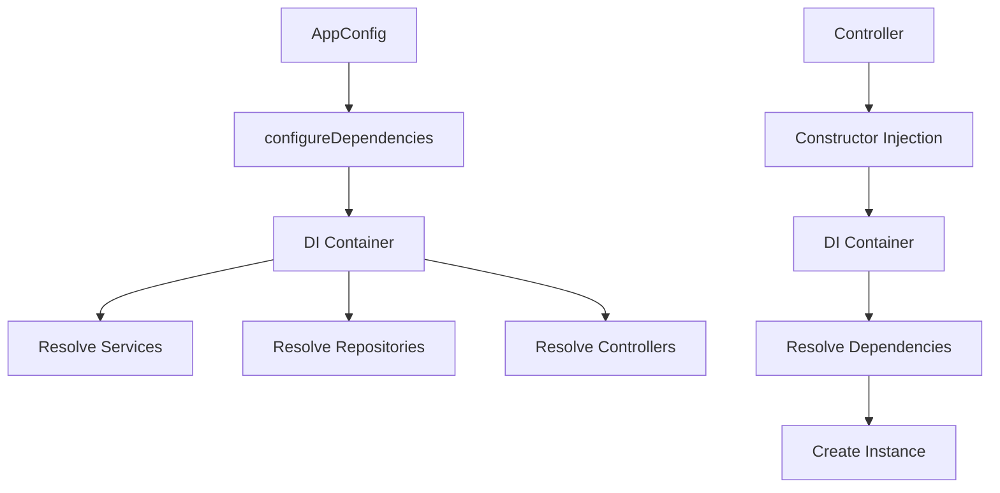

# Configure Dependencies

Dependency injection is a powerful pattern that makes your code more modular, testable, and maintainable. Revali provides a built-in dependency injection system that allows you to register and resolve dependencies throughout your application.

## What is Dependency Injection?

Dependency injection (DI) is a design pattern where dependencies are provided to a class rather than the class creating them itself. This promotes:

- **Loose Coupling**: Classes depend on abstractions, not concrete implementations
- **Testability**: Easy to mock dependencies for unit testing
- **Flexibility**: Can swap implementations without changing dependent code
- **Maintainability**: Centralized dependency management

## How Revali DI Works


```mermaid
graph TD
    A[AppConfig] --> B[configureDependencies]
    B --> C[DI Container]
    C --> D[Resolve Services]
    C --> E[Resolve Repositories]
    C --> F[Resolve Controllers]

    G[Controller] --> H[Constructor Injection]
    H --> I[DI Container]
    I --> J[Resolve Dependencies]
    J --> K[Create Instance]
```

## Registering Dependencies

Use the `configureDependencies` method in your `AppConfig` class to register dependencies:

```dart title="routes/main_app.dart"
import 'package:revali_annotations/revali_annotations.dart';

@App()
class MainApp extends AppConfig {
  const MainApp() : super(host: 'localhost', port: 8080);

  @override
  Future<void> configureDependencies(DI di) async {
    // Register your dependencies here
    di.registerLazySingleton<UserService>(UserServiceImpl.new);
    di.registerFactory<EmailService>(EmailServiceImpl.new);
    di.registerSingleton<DatabaseConnection>(DatabaseConnection());
  }
}
```

## Registration Methods

### `registerLazySingleton<T>`

Creates a single instance that's created only when first requested:

```dart
// Register a service as lazy singleton
di.registerLazySingleton<UserService>(UserServiceImpl.new);

// Usage in controller
class UserController {
  final UserService _userService;

  UserController(this._userService); // Injected automatically
}
```

**When to use:**

- Expensive to create (database connections, HTTP clients)
- Stateless services
- Shared resources across the application

### `registerSingleton<T>`

Registers an already instantiated object:

```dart
// Register a pre-created instance
final config = AppConfig(host: 'localhost', port: 8080);
di.registerSingleton<AppConfig>(config);

// Register environment-specific instances
di.registerSingleton<DatabaseConfig>(DatabaseConfig.fromEnv());
```

**When to use:**

- Configuration objects
- Pre-initialized resources
- Environment-specific instances

### `registerFactory<T>`

Creates a new instance every time it's requested:

```dart
// Register a factory for transient objects
di.registerFactory<Logger>(() => Logger.withTimestamp());

// Register with parameters
di.registerFactory<HttpClient>(() => HttpClient(timeout: Duration(seconds: 30)));
```

**When to use:**

- Stateful objects that shouldn't be shared
- Objects that need fresh state each time
- Temporary or request-scoped objects

## Using Abstractions

Register implementations against interfaces for better testability:

```dart title="routes/main_app.dart"
@override
Future<void> configureDependencies(DI di) async {
  // Register implementation against interface
  di.registerLazySingleton<IUserRepository>(UserRepository.new);
  di.registerLazySingleton<IEmailService>(EmailService.new);
  di.registerLazySingleton<IPaymentService>(StripePaymentService.new);
}
```

```dart title="lib/services/user_service.dart"
class UserService {
  final IUserRepository _userRepository;
  final IEmailService _emailService;

  UserService(this._userRepository, this._emailService);

  Future<User> createUser(CreateUserRequest request) async {
    final user = await _userRepository.create(request);
    await _emailService.sendWelcomeEmail(user.email);
    return user;
  }
}
```

## Complete Example

Here's a complete dependency configuration for a typical application:

```dart title="routes/main_app.dart"
import 'package:revali_annotations/revali_annotations.dart';

@App()
class MainApp extends AppConfig {
  const MainApp() : super(host: 'localhost', port: 8080);

  @override
  Future<void> configureDependencies(DI di) async {
    // Database
    di.registerLazySingleton<DatabaseConnection>(() => DatabaseConnection.fromEnv());

    // Repositories
    di.registerLazySingleton<IUserRepository>(UserRepository.new);
    di.registerLazySingleton<IProductRepository>(ProductRepository.new);

    // Services
    di.registerLazySingleton<IUserService>(UserService.new);
    di.registerLazySingleton<IProductService>(ProductService.new);
    di.registerLazySingleton<IEmailService>(EmailService.new);

    // External APIs
    di.registerLazySingleton<IPaymentService>(StripePaymentService.new);
    di.registerLazySingleton<IAnalyticsService>(GoogleAnalyticsService.new);

    // Utilities
    di.registerFactory<Logger>(() => Logger.withTimestamp());
    di.registerSingleton<AppConfig>(this);
  }
}
```

## Dependency Resolution

Dependencies are automatically resolved when controllers are created:

```dart title="routes/user_controller.dart"
import 'package:revali_annotations/revali_annotations.dart';

@Controller('/users')
class UserController {
  final IUserService _userService;
  final IEmailService _emailService;

  // Dependencies are injected automatically
  UserController(this._userService, this._emailService);

  @Get('/')
  Future<List<User>> getUsers() async {
    return await _userService.getAllUsers();
  }

  @Post('/')
  Future<User> createUser(@Body() CreateUserRequest request) async {
    final user = await _userService.createUser(request);
    await _emailService.sendWelcomeEmail(user.email);
    return user;
  }
}
```

## The `Inject` Marker Class

Annotation arguments in Dart must be compile-time constants. That works well for literals and `const` constructors, but not for runtime dependencies such as services or repositories.

The [`Inject`][inject] base class from `revali_annotations` bridges that gap. Extend it to create a marker type that is constant at compile time while still telling Revali which dependency to resolve from the DI container at runtime.

### When to Use `Inject`

Use `Inject` when a custom annotation needs **both**:

- A compile-time value (for example, a status code or configuration flag)
- A dependency that can only be created at runtime

Common cases include [`LifecycleComponent`][lifecycle-component] constructors and other annotation types that mix primitive configuration with injected services.

### Creating an Inject Marker

Define a `const` class that extends `Inject` and implements the interface you want resolved:

```dart title="lib/di/inject_service.dart"
import 'package:revali_annotations/revali_annotations.dart';

final class InjectService extends Inject implements Service {
  const InjectService();
}
```

The marker class itself has no behavior. It only carries type information so Revali knows what to resolve from DI.

### Using Inject Markers in Annotations

Pass the marker instance alongside your compile-time values:

```dart title="routes/user_controller.dart"
class MyComponent implements LifecycleComponent {
  const MyComponent(this.statusCode, this.service);

  final int statusCode;
  final Service service;
}

@Controller('/users')
class UserController {
  @MyComponent(200, InjectService())
  @Get('/')
  User getUser() => ...;
}
```

Without `Inject`, passing `Service()` directly would fail because it is not a compile-time constant:

```dart
@MyComponent(200, Service()) // Error: Service is not a constant
```

### How Revali Resolves `Inject` Types

When Revali sees an annotation argument whose type extends `Inject`, it:

1. Confirms the class extends `Inject` (so it is safe to treat as a marker)
2. Looks at the interfaces or base classes the marker implements (for example, `Service`)
3. Resolves the registered implementation from the DI container

The dependency must be registered in `configureDependencies` like any other injectable type:

```dart title="routes/main_app.dart"
@override
Future<void> configureDependencies(DI di) async {
  di.registerLazySingleton<Service>(ServiceImpl.new);
}
```

### `Inject` vs `@Dep()`

These solve different problems:

| Mechanism | Where it works                                  | Use case                                                                    |
| --------- | ----------------------------------------------- | --------------------------------------------------------------------------- |
| `@Dep()`  | Controller constructors and endpoint parameters | Inject dependencies into route handlers                                     |
| `Inject`  | Custom annotation arguments                     | Mix compile-time configuration with runtime dependencies inside annotations |

For controller and endpoint injection, prefer `@Dep()`. Reach for `Inject` only when a dependency must appear inside an annotation argument list.

## Request-Scoped Dependencies

Some dependencies should only exist for the duration of a single request — for example, a per-request database transaction or user session context. Use [`RequestScopedDI`][request-scoped-di] together with a [request wrapper][request-wrapper] to create an isolated DI container for each request.

Install the scope in a request wrapper using a `Zone`:

```dart title="lib/components/request_scope.dart"
import 'package:revali_core/revali_core.dart';
import 'package:revali_router/revali_router.dart';

class RequestScope implements LifecycleComponent {
  const RequestScope();

  WrapperResult wrap(NextResponse next, DI parentDi) {
    final scoped = RequestScopedDI(parent: parentDi);

    return runZoned(
      () async {
        try {
          return await next();
        } finally {
          await scoped.dispose();
        }
      },
      zoneValues: {RequestScopedDI.zoneKey: scoped},
    );
  }
}
```

Register request-scoped dependencies inside middleware or the endpoint:

```dart
RequestScopedDI.current.registerSingleton<Transaction>(Transaction());
```

Resolve dependencies with a fallback to the app-level container:

```dart
final service = RequestScopedDI.getFrom<MyService>(appDi);
```

:::tip
Learn more about [request wrappers][request-wrapper].
:::

## Best Practices

### 🏗️ **Architecture**

- **Register by Interface**: Use interfaces for better testability
- **Group Related Dependencies**: Organize registrations logically
- **Use Appropriate Lifetimes**: Choose the right registration method for each dependency

### 🧪 **Testing**

- **Mock Dependencies**: Easy to replace implementations with mocks
- **Test Configuration**: Create separate DI configurations for testing
- **Isolate Dependencies**: Each test should have its own dependency instances

### 🚀 **Performance**

- **Lazy Singletons**: Use for expensive resources
- **Factory for Transients**: Use for objects that need fresh state
- **Avoid Over-Registration**: Only register what you actually need

### 🔒 **Security**

- **Environment Variables**: Use for sensitive configuration
- **Scoped Dependencies**: Limit dependency scope when possible
- **Validation**: Validate configuration values at startup

## Common Patterns

### Service Layer Pattern

```dart
// Repository (Data Access)
abstract class IUserRepository {
  Future<User?> findById(String id);
  Future<User> create(CreateUserRequest request);
}

// Service (Business Logic)
abstract class IUserService {
  Future<User> createUser(CreateUserRequest request);
  Future<User> getUserById(String id);
}

// Controller (API Layer)
@Controller('/users')
class UserController {
  final IUserService _userService;
  UserController(this._userService);
}
```

### Configuration Pattern

```dart
class DatabaseConfig {
  final String host;
  final int port;
  final String database;

  DatabaseConfig.fromEnv()
    : host = Platform.environment['DB_HOST'] ?? 'localhost',
      port = int.parse(Platform.environment['DB_PORT'] ?? '5432'),
      database = Platform.environment['DB_NAME'] ?? 'myapp';
}
```

## Troubleshooting

### Common Issues

**Dependency Not Found:**

- Ensure the dependency is registered in `configureDependencies`
- Check that the type matches exactly
- Verify the dependency is registered before it's needed

**Singleton State Issues:**

- Use factories for stateful objects

## Next Steps

- **[Environment Variables](/revali/app-configuration/env-vars)**: Handle configuration across environments
- **[Flavors](/revali/app-configuration/flavors)**: Create environment-specific configurations

[inject]: https://pub.dev/documentation/revali_annotations/latest/revali_annotations/Inject-class.html
[lifecycle-component]: /constructs/revali_server/lifecycle-components/overview
[request-scoped-di]: https://pub.dev/documentation/revali_core/latest/revali_core/RequestScopedDI-class.html
[request-wrapper]: /constructs/revali_server/lifecycle-components/advanced/wrapper
