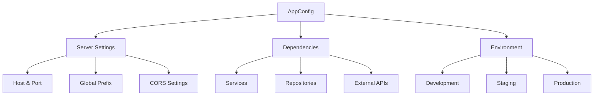

# App Configuration

App configuration is the foundation of your Revali application. It defines how your server runs, what dependencies are available, and how requests are handled. Every revali app has at least one app configuration (even when you haven't created one yet).

## What is an AppConfig?

An `AppConfig` is a class that extends Revali's base configuration and defines:

- **Server Settings**: Host, port, and global prefix
- **Dependencies**: Services, repositories, and other injectable objects
- **Environment**: Development, staging, or production settings

## Key Concepts

### 🏗️ **Application Entry Point**

The app configuration serves as the entry point for your Revali application. It's where you define how your server should behave and what resources it needs.

### 🔧 **Dependency Injection**

Configure all your application's dependencies in one place. Revali's built-in dependency injection system makes it easy to manage services, repositories, and other components.

### 🌍 **Environment Management**

Create different configurations for different environments (development, staging, production) using [flavors](/revali/app-configuration/flavors).

### ⚙️ **Centralized Configuration**

All server settings and dependencies are configured in a single, well-organized location.

## Default Configuration

Revali provides sensible defaults that work out-of-the-box:

```dart
AppConfig(
    hostname: 'localhost',
    port: 8080,
    prefix: '/api',
)
```

This means your API will be available at `http://localhost:8080/api/`

## Configuration Hierarchy



## Quick Start

1. **[Create an App](/revali/app-configuration/create-an-app)**: Set up your basic app configuration
2. **[Configure Dependencies](/revali/app-configuration/configure-dependencies)**: Register services and repositories
3. **[Environment Variables](/revali/app-configuration/env-vars)**: Handle configuration across environments
4. **[Flavors](/revali/app-configuration/flavors)**: Create environment-specific configurations

## Best Practices

### 📁 **File Organization**

- Place app files in the `routes/` directory
- Use descriptive names like `main_app.dart` or `api_app.dart`
- Follow the naming convention: `*_app.dart` or `*.app.dart`

### 🔄 **Dependency Management**

- Register dependencies in logical groups
- Use interfaces for better testability
- Prefer lazy singletons for expensive resources

### 🌐 **Environment Configuration**

- Use environment variables for sensitive data
- Create separate flavors for different environments
- Keep development and production configs separate

### 🛡️ **Security**

- Never hardcode secrets in configuration files
- Use environment variables for API keys and passwords
- Validate configuration values at startup

## Next Steps

- **[Create an App](/revali/app-configuration/create-an-app)**: Learn how to create your first app configuration
- **[Configure Dependencies](/revali/app-configuration/configure-dependencies)**: Set up dependency injection
- **[Environment Variables](/revali/app-configuration/env-vars)**: Handle configuration across environments
