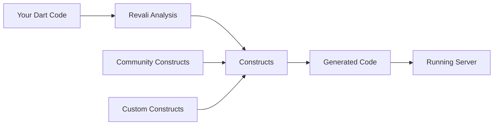

# Overview

## What is Revali?

Revali is a modern, fast, and powerful Dart API framework that makes building robust web services effortless. It leverages annotations within your classes, methods, and method parameters to automatically generate API code, allowing developers to focus on writing clean, maintainable business logic while Revali handles the boilerplate.

## Key Features

- **Type-Safe**: Built on Dart's strong typing system for compile-time safety
- **Annotation-Driven**: Define APIs using simple, intuitive annotations
- **Highly Extendable**: Create custom constructs or use community packages
- **Rapid Development**: Minimal setup and configuration required
- **Hot Reload**: Instant development feedback with hot reload support

## How does it work?

Revali analyzes your Dart classes, methods, and annotations to generate code through "constructs". These constructs are standalone Dart packages that are imported into your project, automatically detected by Revali, and used to generate the necessary code. This modular approach allows you to easily extend Revali's capabilities by creating your own constructs or using constructs created by the community.

:::tip
Learn more about [constructs](/constructs) and how they power Revali's code generation.
:::

## Quick Start

Ready to build your first API? Get started in minutes:

1. **[Install Revali](/revali/getting-started/installation)** - Add Revali to your project
2. **[Create Your First Endpoint](/revali/getting-started/create-your-first-endpoint)** - Build a simple API endpoint
3. **[Run the Server](/revali/getting-started/run-the-server)** - See your API in action

:::info
For a complete server implementation, check out the [Revali Server](/constructs/revali_server/overview) construct guide.
:::
